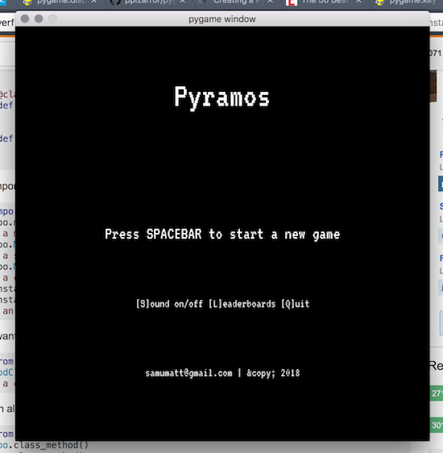
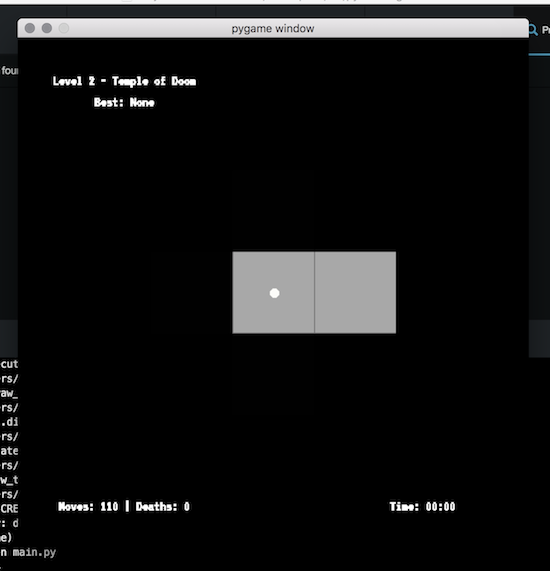

This is **PyRAMOS**, a dungeon crawling puzzle game. Help King Tut reach the end!

The game is developed using Python and PyGame.

## Requirements

- [Python](https://www.python.org/) (ver. 3.7.0)
- [Virtualenv](https://virtualenv.pypa.io/en/stable/) (ver. 16.0.0)
- [PyGame](http://www.pygame.org/news.html) (ver. 1.9.4)

## Installation

- clone the repository
- create a virtualenv `mkvirtualenv pyramos-game`
- install the requirements `pip install -r requirements.txt`
- run the app `python main.py`

## How To Play:

- you will see a cross-shaped configuration of 5 tiles at the center of your screen
- the "player" is always in the central tile
- only the tiles above, below, to the left and to the right of the player will be uncovered
- every move will change the configuration of the 4 tiles adjacent to the player based on their position on the map
- only the floor tiles are movable on
- use the arrow keys to navigate the maps
- reach the end of each level
- avoid hitting moving towards a wall / boundary

## To-Do(s):

- rename the game!
- make it stand alone
- more levels
- more puzzles

## Author:

[Samuele Mattiuzzo](https://samuele-mattiuzzo.github.io) <samumatt@gmail.com> &copy; 2018
